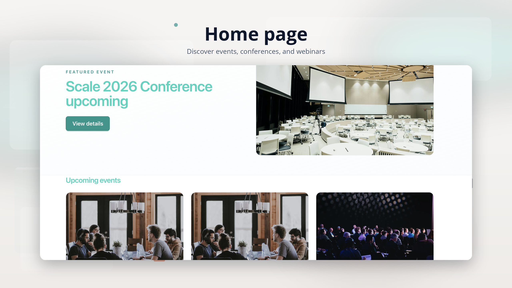
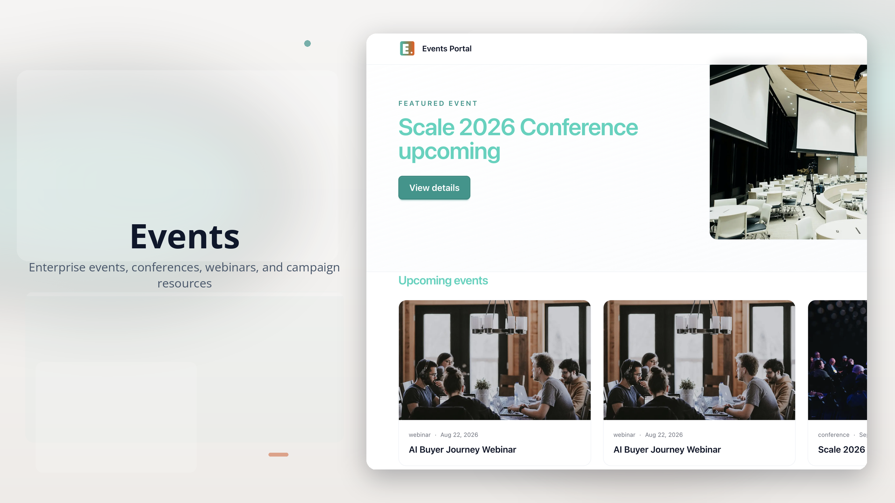
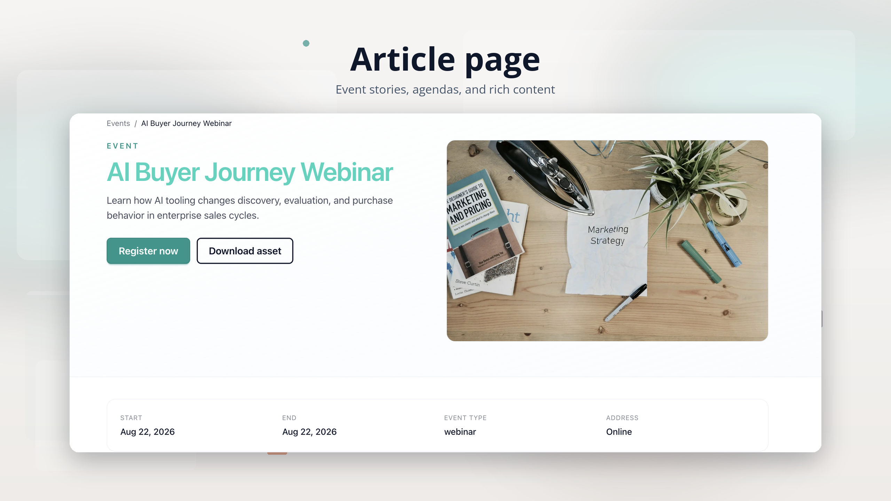
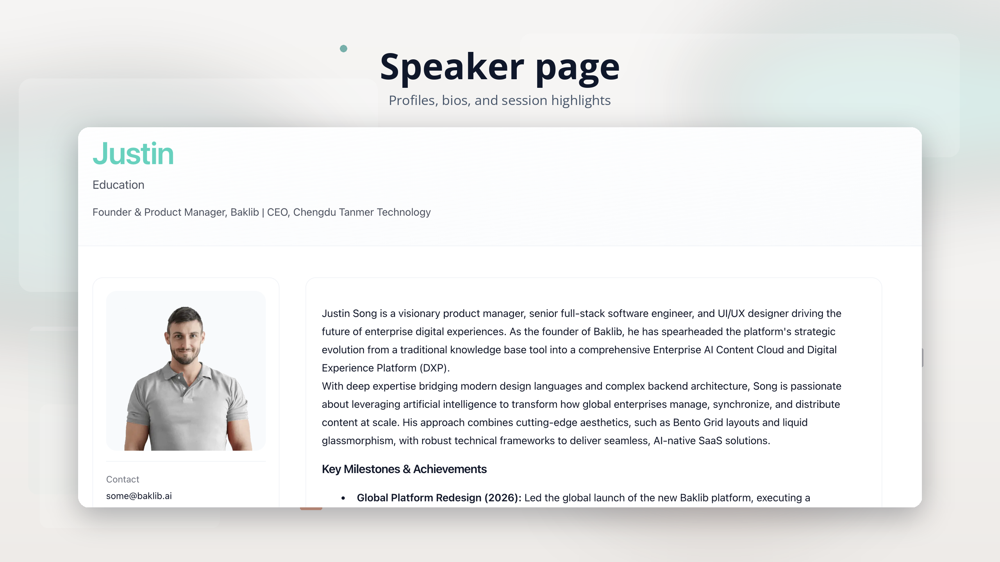
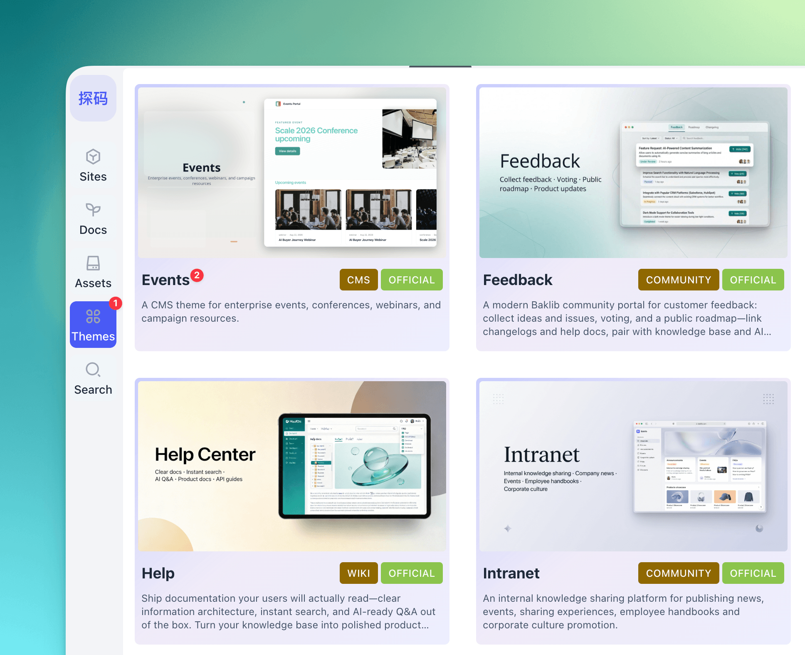
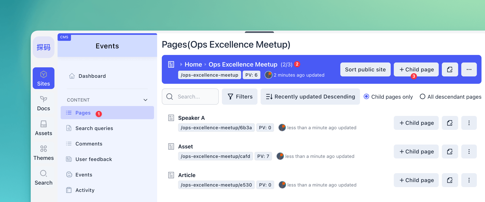
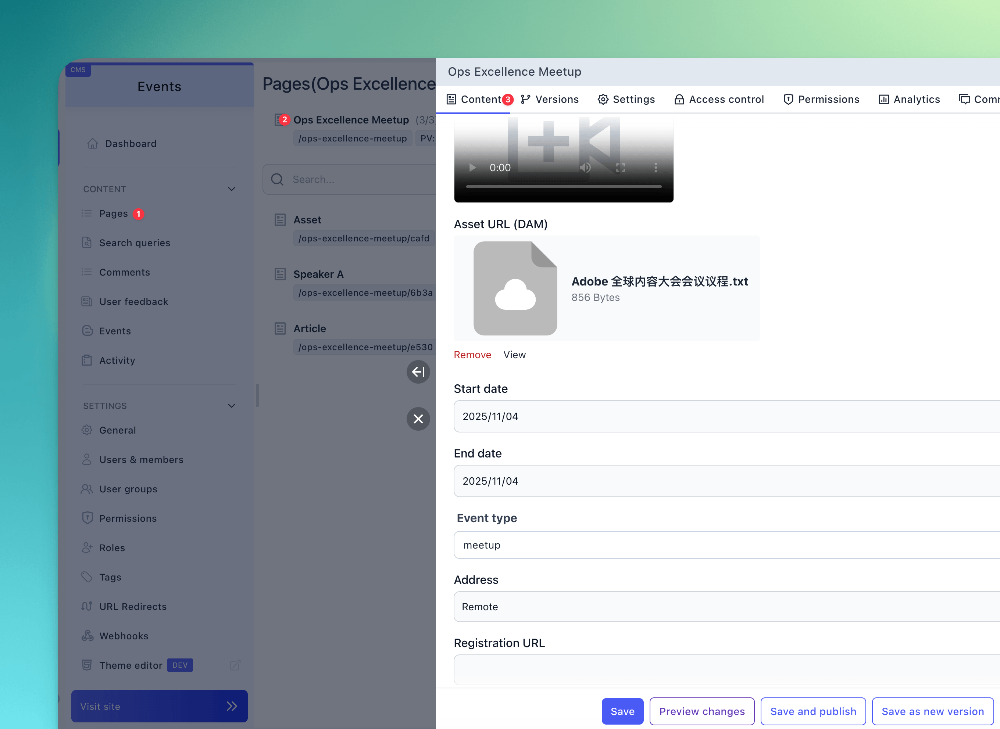

# Baklib CMS — Events theme

A lightweight **events / conferences / webinars** theme for Baklib-powered sites. It ships with event schedule categorization, speaker showcases, slide/resource downloads, related news updates, and Tailwind CSS–based styling.

Template Git URL: https://github.com/baklib-templates/events

---

## Features

Repository Layout

| Path                          | Purpose                                                         |
| ----------------------------- | --------------------------------------------------------------- |
| `templates/`                  | Page templates                                                  |
| `snippets/`                   | Partials / Snippets                                             |
| `layout/`                     | `theme.liquid` site shell                                       |
| `config/settings_schema.json` | Theme settings schema                                           |
| `locales/`                    | UI strings (`*.json`) and schema translations (`*.schema.json`) |
| `seeds/`                      | Sample site and pages (default **English**)                     |
| `assets/`                     | Built CSS/JS                                                    |
| `src/`                        | Source for Tailwind and JS                                      |

---

- **Home**: events directory / index (`templates/index.liquid`) supporting schedule categories, status filters (upcoming, past, recent), search, and tags.
- **Channel**: detailed schedule/event track page (`templates/channel.liquid`) showing track details, timetable, speakers, resources, and news.
- **Article** (`templates/page.article.liquid`): news article page for event updates.
- **Asset** (`templates/page.asset.liquid`): slides and materials download page.
- **Person** (`templates/page.person.liquid`): speaker bio and profile page.
- **Search** (`templates/search.liquid`), **tag listing** (`templates/tag.liquid`).

---

## Preview

|                 Home (Events Index)                  |                 Cover (Thumbnail)                  |
| :--------------------------------------------------: | :------------------------------------------------: |
|             |          |
|                   **Article Page**                   |                  **Speaker Page**                  |
|   |  |

---

## Installation

Find "Events" in the Baklib template marketplace, click install, and it's done.

|                 1. Select and Install Theme                 |                    2. Conference Structure Configuration                     |                 3. Conference / Event Settings                  |
| :---------------------------------------------------------: | :--------------------------------------------------------------------------: | :-------------------------------------------------------------: |
|  |  |  |

---

## Other Documents

- Chinese Overview: [README.zh-CN.md](./README.zh-CN.md)
- Theme Help: [www.baklib.ai/themes](https://www.baklib.ai/themes/events)
